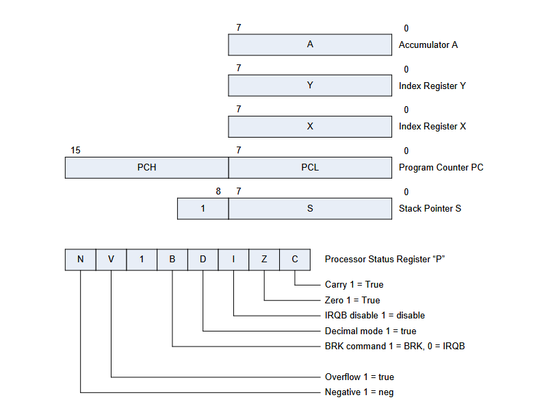
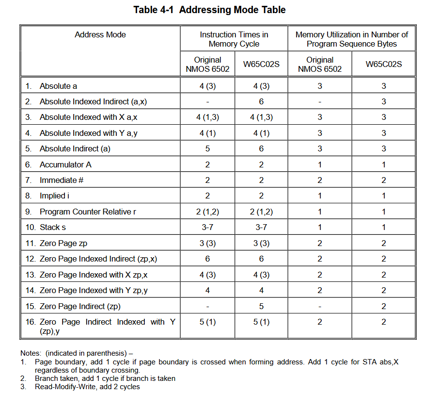
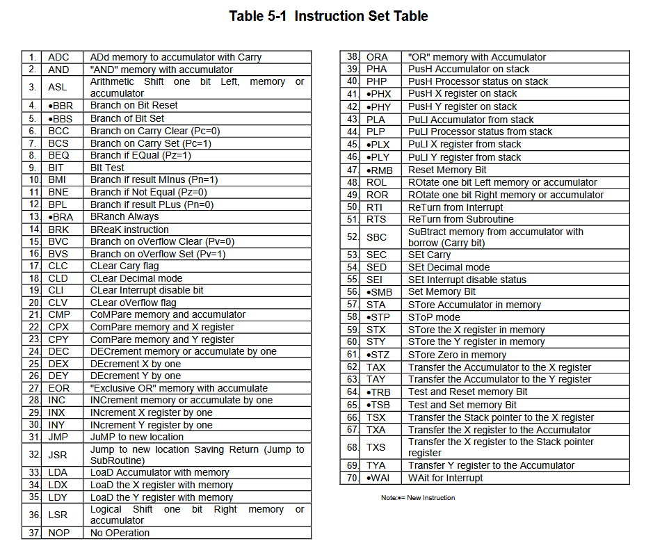

## W65C02S Emulator

### Tests
```
pip install -r requirements-dev.txt
python -m pytest
```
`tests/test_instructions.py` runs every case through the ROM runner, the shell and the assembler.
`tests/test_opcodes.py` checks the opcode table against the datasheet and round-trips every documented opcode through the assembler.
`tests/test_regressions.py` has one test per known bug (B01–B22); open bugs are strict `xfail`,
so fixing one turns its test red until the marker is updated to `fixed_in=<step>`.

### Layout
```
opcodes.py      the opcode table: all 256 opcodes as (mnemonic, mode, size, handler)
modes.py        the 16 addressing modes: operand -> effective address
instructions/   one function per mnemonic, grouped by family
w65c02s.py      the CPU and the ROM runner (python w65c02s.py --rom prog.bin)
asm_to_bin.py   the assembler (python asm_to_bin.py -s prog.s -r prog.bin)
cli.py          the shell; each line is assembled and its bytes executed
addr_modes/     operand syntax parsers used by the assembler
```

### Architecture and instruction set

#### Registers
[]()

#### Addressing modes


#### Instruction set

